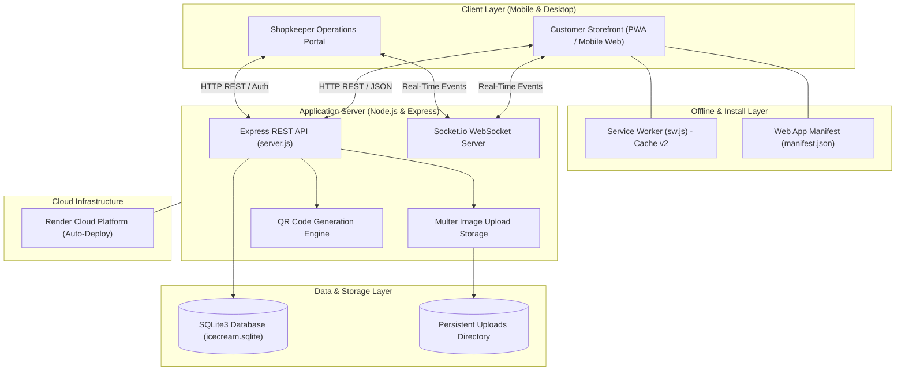
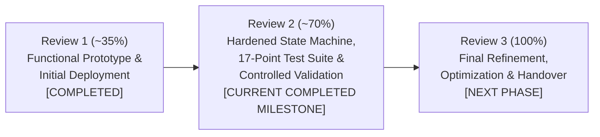

# Surya Agencies — QR-Based Self-Service Ordering & Inventory System

> **Project Better Tomorrow — Project Review 2 Submission**  
> **Milestone Status:** Improved, Tested & Validated Working System (~70% Project Milestone)  
> **Live Production URL:** [https://surya-agencies.onrender.com](https://surya-agencies.onrender.com)  
> **Primary Repository:** [https://github.com/vivin222/surya-agencies-project-review-1](https://github.com/vivin222/surya-agencies-project-review-1)  
> **Evaluation Phase:** Review 2 of 3 (Progressing from ~35% Initial Prototype ➔ ~70% Validated System)  
> **Milestone Clarification:** Review 2 Scope — Completed, Tested & Validated. Overall project completion remains at approximately 70%; Review 3 contains the remaining final-stage work.

---

## 📌 1. Project Overview

**Surya Agencies** is an authorized retail distributor and parlour for **Hatsun Agro Product Ltd** brands, including **Arun Icecreams** and **Hatsun Dairy Products**. 

This project introduces a modern, QR-based self-service ordering and inventory management system engineered to eliminate peak-hour queue bottlenecks, reduce customer waiting times, prevent stock overselling, and streamline daily counter operations for retail dairy and ice cream parlours.

---

## 🚨 2. Problem Statement & Operational Context

In retail ice cream and dairy parlours such as Surya Agencies, evening peak hours and weekend rushes create operational bottlenecks at the counter:

1. **Sequential Queue Congestion:** During peak periods, numerous customers queue up simultaneously while a single shopkeeper handles product inquiries, physically verifies freezer inventory, packs items, calculates billing, and collects payments sequentially.
2. **Inquiry-Driven Delays:** Because customers cannot view available flavors or current stock levels without asking the shopkeeper, the shopkeeper spends significant time opening and searching through deep freezers. This causes extended waiting times, customer frustration, and walkaway abandonment.
3. **Limitations of Conventional Alternatives:**
   * *Traditional Point-of-Sale (POS) Systems:* POS terminals only assist at the final billing stage and do not offload product browsing, inquiry handling, or order configuration from the shopkeeper.
   * *WhatsApp / Phone Ordering:* Requires continuous manual back-and-forth messaging from the shopkeeper during already intense counter hours.

---

## 💡 3. Proposed Solution & Architecture

The **Surya Agencies Self-Service System** provides a lightweight, scan-and-order Web Application and Progressive Web App (PWA) that decouples customer browsing from counter fulfillment:

* **Customer Self-Service:** Customers scan a tabletop/counter QR code or open the web link on their mobile devices to browse the complete 95+ item catalog, verify real-time stock availability, customize their cart, pay via a valid UPI QR code, and receive a digital Order Token with a scannable Ticket QR.
* **Shopkeeper Operations Portal:** The shopkeeper receives instant visual and audio notifications via WebSockets (Socket.io), scans the customer's Ticket QR with a built-in camera scanner, and fulfills orders efficiently with single-tap status transitions.
* **Unified Real-Time Inventory & State Machine:** Prevents overselling by automatically decrementing stock upon order creation, alerts the shopkeeper to low-stock thresholds, enforces strict status transition guards, and maintains transactional stock restoration on cancellations.



---

## 📦 4. Component Breakdown & Implementation Evidence

Each implemented module is grounded in concrete, audited codebase files:

### A. Customer Storefront
* **Interactive Product Catalog (95+ Branded Items):** Full catalog across 8 categories (Cones, Cups & Duets, Bars & Sticks, Tubs, Cakes, Novelties, Sundaes, Dairy) with high-resolution imagery and price specifications.
  * *Evidence:* `index.html`, `js/customer-app.js`, `sample-data.js`
* **Instant Search & Category Filtering:** Real-time client-side text search and responsive horizontal category button boxes with glassmorphic styling.
  * *Evidence:* `js/customer-app.js`, `css/app.css`
* **Persistent Shopping Cart:** LocalStorage-backed cart with item steppers, dynamic total calculations, and out-of-stock validation.
  * *Evidence:* `js/customer-app.js`
* **Scannable UPI Payment QR:** Generates standardized UPI payment QR codes (`upi://pay?pa=...&pn=Surya%20Agencies&am=...`) compatible with Google Pay, PhonePe, Paytm, and BHIM, alongside counter cash options.
  * *Evidence:* `js/customer-app.js`, `js/qrcode.min.js`
* **Digital Pickup Ticket & Token QR:** Instant order token generation (`#A001` – `#Z999`) with a unique scannable Ticket QR code linking directly to the customer's verified order.
  * *Evidence:* `js/customer-app.js`, `server.js`
* **5-Step Live Order Tracking:** Real-time visual order timeline (`Placed` ➔ `Accepted` ➔ `Preparing` ➔ `Ready for Pickup` ➔ `Completed`) synchronized via WebSockets.
  * *Evidence:* `js/customer-app.js`

### B. Shopkeeper Operations Portal
* **Protected Shopkeeper Authentication:** Secure credentials-based session portal for authorized parlour staff.
  * *Evidence:* `server.js`, `js/shopkeeper-app.js`
* **Live Orders Feed:** Real-time order dispatch board with status filters (`All`, `New`, `Accepted`, `Preparing`, `Ready`, `Completed`) and audio chime alerts.
  * *Evidence:* `js/shopkeeper-app.js`
* **Optical Camera Ticket QR Scanner:** In-app QR scanner powered by `Html5Qrcode` with environment camera auto-detection, photo file upload fallback, and universal Order ID / Token lookup.
  * *Evidence:* `index.html`, `js/shopkeeper-app.js`
* **Quick Inventory Controls:** Inline `+1` / `-1` stock modifiers, minimum stock threshold alerts, and instant 1-tap availability toggles (`🟢 AVAILABLE` ↔ `🔴 NOT AVAILABLE`).
  * *Evidence:* `js/shopkeeper-app.js`, `server.js`, `db.js`
* **Product Catalog Management:** Ability to add new products, modify prices, and upload persistent product photos via Multer.
  * *Evidence:* `server.js`, `uploads/`
* **Revenue & Sales Analytics:** Aggregated sales metrics, completed orders tracking, and revenue totals with dark-mode contrast optimization.
  * *Evidence:* `js/shopkeeper-app.js`, `db.js`

### C. Backend, Database & State Machine
* **RESTful API Service:** Express.js API handling product listings, order transactions, QR generation, image uploads, and reporting.
  * *Evidence:* `server.js`
* **ACID-Compliant Relational Database:** SQLite3 database with parameterized SQL, transactional order placement, and automatic stock deduction.
  * *Evidence:* `db.js`, `icecream.sqlite`
* **Strict State Machine Transition Guards:** Explicit database-level state validation preventing invalid lifecycle modifications on terminal states (`COMPLETED` and `CANCELLED`).
  * *Evidence:* `db.js` (`updateOrderStatus`, `completePickup`)
* **Deterministic IST Timestamps:** All orders, notifications, and reports are recorded in server-side ISO 8601 UTC and rendered deterministically in **India Standard Time (IST — Asia/Kolkata)** on all devices.
  * *Evidence:* `db.js`, `js/customer-app.js`, `js/shopkeeper-app.js`
* **Socket.io Real-Time Synchronization:** WebSocket events broadcasting new orders, status transitions, inventory changes, and availability toggles.
  * *Evidence:* `server.js`, `js/socket-client.js`

### D. Progressive Web App (PWA) Foundation
* **Web App Manifest:** Standalone display configuration with brand icons (192x192, 512x512) and theme color (`#e11d48`).
  * *Evidence:* `manifest.json`
* **Service Worker Caching:** Cache-first asset delivery with dynamic network-first routing for API and WebSocket connections.
  * *Evidence:* `sw.js`
* **Platform-Specific Install Flow:** Native PWA installation on Android/Chrome and guided 3-step Home Screen addition on iOS Safari.
  * *Evidence:* `index.html`, `js/app.js`

---

## 🗄️ 5. SQLite Database Schema Specification

The application uses an embedded, ACID-compliant **SQLite3** database (`icecream.sqlite`) with parameterized queries, default timestamps, and indexed primary keys as implemented in `db.js`:

### Table 1: `products`
Stores product catalog specifications, pricing, stock levels, and category groupings.

| Column | Data Type | Constraints | Description |
| :--- | :--- | :--- | :--- |
| `id` | `TEXT` | `PRIMARY KEY` | Unique product identifier (e.g. `prod-cones-01`) |
| `name` | `TEXT` | `NOT NULL` | Brand product name (e.g. *Arun Disc Cone Butterscotch 120ml*) |
| `category` | `TEXT` | `NOT NULL` | Category name (Cones, Cups & Duets, Bars & Sticks, Tubs, Cakes, etc.) |
| `packSize` | `TEXT` | `DEFAULT 'Standard Pack'` | Packaging quantity / volume specification |
| `price` | `REAL` | `DEFAULT NULL` | Retail selling price in Indian Rupees (₹) |
| `costPrice` | `REAL` | `DEFAULT NULL` | Wholesale cost price for profit calculation |
| `stock` | `INTEGER` | `NOT NULL DEFAULT 0` | Total available inventory count |
| `available` | `INTEGER` | `NOT NULL DEFAULT 1` | Binary availability toggle (`1` = Available, `0` = Unavailable) |
| `minThreshold`| `INTEGER` | `NOT NULL DEFAULT 5` | Low-stock warning trigger threshold |
| `description` | `TEXT` | `DEFAULT ''` | Product flavor and packaging description |
| `image` | `TEXT` | `DEFAULT ''` | Image asset path or uploaded file URI |
| `createdAt` | `DATETIME` | `DEFAULT CURRENT_TIMESTAMP` | Initial product creation timestamp (UTC) |
| `updatedAt` | `DATETIME` | `DEFAULT CURRENT_TIMESTAMP` | Last modification timestamp (UTC) |

### Table 2: `orders`
Stores order records, customer identifiers, payment states, and lifecycle progression.

| Column | Data Type | Constraints | Description |
| :--- | :--- | :--- | :--- |
| `id` | `TEXT` | `PRIMARY KEY` | Canonical order identifier (e.g. `order-1725792000000-xyz`) |
| `orderNumber` | `TEXT` | `NOT NULL UNIQUE` | Human-readable Order Token (e.g. `#A001` to `#Z999`) |
| `customerId` | `TEXT` | `DEFAULT NULL` | Customer ID link if logged in |
| `customerName` | `TEXT` | `NOT NULL` | Customer name provided at checkout |
| `customerPhone`| `TEXT` | `DEFAULT NULL` | Customer contact number |
| `customerEmail`| `TEXT` | `DEFAULT NULL` | Customer email address |
| `items` | `TEXT` | `NOT NULL` | JSON-serialized array of ordered items, quantities, and item totals |
| `total` | `REAL` | `NOT NULL` | Total order value in INR (₹) |
| `paymentMethod`| `TEXT` | `NOT NULL` | Payment channel (`'upi'` or `'cash'`) |
| `paymentStatus`| `TEXT` | `NOT NULL` | Payment state (`'PENDING'`, `'PAID'`, `'REFUNDED'`) |
| `orderStatus` | `TEXT` | `NOT NULL` | State machine status: `NEW`, `ACCEPTED`, `PREPARING`, `READY_FOR_PICKUP`, `COMPLETED`, `CANCELLED` |
| `notes` | `TEXT` | `DEFAULT ''` | Customer order notes / instructions |
| `createdAt` | `DATETIME` | `DEFAULT CURRENT_TIMESTAMP` | Server-side order creation timestamp (ISO 8601 UTC) |
| `updatedAt` | `DATETIME` | `DEFAULT CURRENT_TIMESTAMP` | Last status modification timestamp (UTC) |

### Table 3: `customers`
Stores customer profile records and authentication links.

| Column | Data Type | Constraints | Description |
| :--- | :--- | :--- | :--- |
| `id` | `TEXT` | `PRIMARY KEY` | Unique customer identifier |
| `name` | `TEXT` | `NOT NULL` | Customer name |
| `email` | `TEXT` | `DEFAULT NULL` | Customer email address |
| `phone` | `TEXT` | `DEFAULT NULL` | Customer mobile number |
| `avatar` | `TEXT` | `DEFAULT ''` | Customer profile avatar image URL |
| `googleId` | `TEXT` | `DEFAULT NULL` | Google OAuth subject identifier |
| `authProvider` | `TEXT` | `DEFAULT 'local'` | Authentication source (`'local'`, `'google'`, `'phone'`) |
| `createdAt` | `DATETIME` | `DEFAULT CURRENT_TIMESTAMP` | Registration timestamp (UTC) |
| `lastActive` | `DATETIME` | `DEFAULT CURRENT_TIMESTAMP` | Last activity timestamp (UTC) |

### Table 4: `settings`
Stores parlour operational parameters, shop details, UPI ID, and credentials.

| Column | Data Type | Constraints | Description |
| :--- | :--- | :--- | :--- |
| `key` | `TEXT` | `PRIMARY KEY` | Configuration key name |
| `value` | `TEXT` | `NOT NULL` | Configuration value string |

---

## 🔌 6. REST API Reference Documentation

The application exposes a clean, RESTful JSON API for storefront and parlour operations as implemented in `server.js`:

### 1. Authentication Endpoints
* **`POST /api/auth/shopkeeper/login`**
  * **Description:** Authenticates shopkeeper credentials and returns a session token.
  * **Auth:** Public
  * **Payload:** `{ "username": "...", "password": "..." }`
  * **Response:** `200 OK` — `{ "success": true, "token": "...", "message": "..." }` | `401 Unauthorized`

* **`POST /api/auth/customer/google`**
  * **Description:** Handles customer Google OAuth sign-in payload.
  * **Auth:** Public
  * **Payload:** `{ "credential": "...", "name": "...", "email": "...", "avatar": "...", "googleId": "..." }`
  * **Response:** `200 OK` — `{ "success": true, "customer": { ... }, "token": "..." }`

* **`POST /api/auth/customer/send-otp`**
  * **Description:** Generates a 4-digit verification OTP for customer phone login.
  * **Auth:** Public
  * **Payload:** `{ "phone": "9840012345" }`
  * **Response:** `200 OK` — `{ "success": true, "message": "...", "otpPreview": "..." }`

* **`POST /api/auth/customer/verify-otp`**
  * **Description:** Validates customer phone OTP and creates/logs in customer session.
  * **Auth:** Public
  * **Payload:** `{ "phone": "9840012345", "otp": "1234", "name": "Customer Name" }`
  * **Response:** `200 OK` — `{ "success": true, "customer": { ... }, "token": "..." }`

### 2. Product Catalog Endpoints
* **`GET /api/products`**
  * **Description:** Retrieves all catalog products with real-time stock levels, pricing, and availability flags.
  * **Auth:** Public
  * **Response:** `200 OK` — `{ "success": true, "products": [ { "id": "prod-01", "name": "...", "price": 50, "stock": 35, "available": true, ... } ] }`

* **`GET /api/products/:id`**
  * **Description:** Retrieves details for a specific product by ID.
  * **Auth:** Public
  * **Response:** `200 OK` — `{ "success": true, "product": { ... } }` | `404 Not Found`

* **`POST /api/products`**
  * **Description:** Adds a new product to the catalog with real-time WebSocket broadcast.
  * **Auth:** Shopkeeper Credentials (`x-shopkeeper-verified: true` or `Authorization: Bearer <token>`)
  * **Payload:** `{ "name": "...", "category": "...", "price": 50, "stock": 30, "available": true, ... }`
  * **Response:** `201 Created` — `{ "success": true, "product": { ... } }`

* **`PATCH /api/products/:id`**
  * **Description:** Updates product fields (price, stock, minimum threshold, availability toggle, pack size, image).
  * **Auth:** Shopkeeper Credentials
  * **Payload:** `{ "stock": 45, "available": true }`
  * **Response:** `200 OK` — `{ "success": true, "product": { ... } }`

* **`POST /api/upload/image`**
  * **Description:** Uploads product photo via Multer (multipart form) or accepts Base64 image payload.
  * **Auth:** Shopkeeper Credentials
  * **Response:** `200 OK` — `{ "success": true, "url": "data:image/jpeg;base64,...", "staticUrl": "/uploads/..." }`

### 3. Order Management Endpoints
* **`POST /api/orders`**
  * **Description:** Validates customer cart, verifies stock availability, decrements inventory atomically, and creates order with unique Token and Ticket QR.
  * **Auth:** Public
  * **Payload:**
    ```json
    {
      "customerName": "Ramesh Kumar",
      "customerPhone": "9840012345",
      "items": [
        { "productId": "prod-cones-01", "name": "Arun Disc Cone Butterscotch", "price": 50, "quantity": 2 }
      ],
      "paymentMethod": "upi",
      "paymentStatus": "PAID"
    }
    ```
  * **Response:** `201 Created` — `{ "success": true, "order": { "id": "order-...", "orderNumber": "#A001", "orderStatus": "NEW", ... }, "updatedProducts": [ ... ] }`

* **`GET /api/orders`**
  * **Description:** Retrieves all orders for the shopkeeper dashboard feed.
  * **Auth:** Shopkeeper Credentials
  * **Response:** `200 OK` — `{ "success": true, "orders": [ ... ] }`

* **`GET /api/orders/:id`**
  * **Description:** Fetches order details by Order ID or Order Number.
  * **Auth:** Public (for customer tracking) / Shopkeeper
  * **Response:** `200 OK` — `{ "success": true, "order": { ... } }` | `404 Not Found`

* **`GET /api/customer/orders`**
  * **Description:** Fetches order history for a specific customer by phone, email, or customer ID.
  * **Auth:** Public
  * **Response:** `200 OK` — `{ "success": true, "orders": [ ... ] }`

* **`GET /api/orders/lookup/:query`**
  * **Description:** Universal lookup resolving orders by Raw ID (`order-...`), Token (`#A001` or `A001`), or URI-encoded query.
  * **Auth:** Public / Scanner
  * **Response:** `200 OK` — `{ "success": true, "order": { ... } }` | `404 Not Found`

* **`PATCH /api/orders/:id/status`**
  * **Description:** Transitions order status across state machine lifecycle (`NEW` ➔ `ACCEPTED` ➔ `PREPARING` ➔ `READY_FOR_PICKUP` ➔ `COMPLETED` / `CANCELLED`). Automatically restores stock on cancellation.
  * **Auth:** Shopkeeper Credentials
  * **Payload:** `{ "status": "PREPARING" }`
  * **Response:** `200 OK` — `{ "success": true, "order": { ... } }` | `400 Bad Request` (Invalid transition)

* **`POST /api/orders/:id/pickup`**
  * **Description:** Shopkeeper completes pickup via Ticket QR scan. Enforces cancellation protection and double-pickup prevention.
  * **Auth:** Shopkeeper Credentials
  * **Response:** `200 OK` — `{ "success": true, "order": { ... }, "message": "Order pickup verified and completed!" }`

### 4. QR Code, Analytics & Settings Endpoints
* **`GET /api/qr`**
  * **Description:** Generates high-contrast vector SVG or PNG QR code from query text/data.
  * **Auth:** Public
  * **Parameters:** `?text=...&format=svg|png`
  * **Response:** `200 OK` (Content-Type: `image/svg+xml` or `image/png`)

* **`GET /api/stats/dashboard`**
  * **Description:** Computes aggregated product count, total stock, active order counts, completed pickups, and revenue.
  * **Auth:** Shopkeeper Credentials
  * **Response:** `200 OK` — `{ "success": true, "stats": { "totalProducts": 95, "ordersCompleted": 1, "totalRevenue": 100, ... } }`

* **`GET /api/reports/revenue`**
  * **Description:** Returns sales reporting data and financial breakdowns.
  * **Auth:** Shopkeeper Credentials
  * **Response:** `200 OK` — `{ "success": true, "reports": { ... } }`

* **`GET /api/settings`**
  * **Description:** Retrieves parlour operational settings (shop name, phone, UPI ID, address).
  * **Auth:** Public (credentials sanitized)
  * **Response:** `200 OK` — `{ "success": true, "settings": { "shopName": "Surya Agencies", ... } }`

* **`PATCH /api/settings`**
  * **Description:** Updates shop configuration and UPI ID with real-time WebSocket broadcast.
  * **Auth:** Shopkeeper Credentials
  * **Response:** `200 OK` — `{ "success": true, "settings": { ... } }`

---

## 📈 7. Review-2 Controlled Testing & Functional Validation Findings

Review 2 validation focused on controlled functional testing of ordering, inventory protection, cancellation handling, QR/ticket resolution, state transitions, IST timestamps, dashboard analytics, and error handling:

### Controlled Validation Summary

| Evaluation Area | Evaluated System Workflow | Automated Test Verification |
| :--- | :--- | :--- |
| **Product Discovery & Catalog** | Browsing complete 95+ item catalog across 8 categories | **Verified & Passing (Test 1)** |
| **Availability Controls** | 1-tap availability toggle (`🟢 AVAILABLE` ↔ `🔴 NOT AVAILABLE`) | **Verified & Passing (Test 2)** |
| **Order Quantity Bounds** | Rejection of non-positive or malformed quantities | **Verified & Passing (Test 3)** |
| **Inventory Deduction** | Automatic atomic stock decrement upon order creation | **Verified & Passing (Test 4)** |
| **Insufficient Stock Protection** | Immediate rejection when order quantity exceeds stock | **Verified & Passing (Test 5)** |
| **Zero-Stock Handling** | Transition to out-of-stock when inventory reaches 0 | **Verified & Passing (Test 6)** |
| **Product Stock Allocation** | Dynamic product creation with initial stock allocation | **Verified & Passing (Test 7)** |
| **Order Token Generation** | Sequential human-readable token generation (`#A001` format) | **Verified & Passing (Test 8)** |
| **Multi-Format Ticket Lookup** | Order lookup by Raw ID, `#Token`, clean token, and URL | **Verified & Passing (Test 9)** |
| **Optical QR Generation & Scan** | Standardized Data URL QR code payload generation and resolution | **Verified & Passing (Test 10)** |
| **5-Step Order Lifecycle** | Full sequential progression (`NEW` ➔ `ACCEPTED` ➔ `PREPARING` ➔ `READY` ➔ `COMPLETED`) | **Verified & Passing (Test 11)** |
| **Order Cancellation & Stock Restoration** | Atomic restoration of reserved inventory upon cancellation | **Verified & Passing (Test 12)** |
| **State Machine Transition Guards** | Protection rejecting status modifications on completed/cancelled orders | **Verified & Passing (Test 13)** |
| **Invalid Payload Rejection** | Rejection of empty item arrays or missing customer names | **Verified & Passing (Test 14)** |
| **Deterministic IST Timestamps** | Server UTC timestamps rendered deterministically in `Asia/Kolkata` | **Verified & Passing (Test 15)** |
| **Dashboard Analytics Aggregation** | Accurate calculation of total products, completed orders, and revenue | **Verified & Passing (Test 16)** |
| **Non-Existent Resource Handling** | Safe `null` / `404` handling for missing orders or products | **Verified & Passing (Test 17)** |

---

## 🛠️ 8. Technology Stack

| Component | Technology | Version / Specification | Role in System |
| :--- | :--- | :--- | :--- |
| **Frontend Framework** | Vanilla JavaScript | ES6+ Standard | Client-side application logic and state management |
| **UI Styling** | Tailwind CSS | Tailwind CDN v3.x + Custom CSS | Mobile-first responsive UI with Dark/Light theme support |
| **Backend Engine** | Node.js / Express.js | Express v4.21.2 | REST API routing, authentication, and static asset delivery |
| **Real-Time Layer** | Socket.io | Socket.io v4.8.1 | Bi-directional WebSocket communication for live sync |
| **Database** | SQLite3 | sqlite3 v5.1.7 | Embedded relational database with ACID transactions |
| **QR Code Engine** | `qrcode` / `html5-qrcode` | qrcode v1.5.4, html5-qrcode v2.3.8 | Optical QR generation and device camera scanning |
| **File Handling** | Multer | multer v1.4.5-lts.1 | Multipart form upload handling for product imagery |
| **PWA Layer** | Service Worker API | Cache API v2 | Offline asset caching and mobile installability |
| **Cloud Hosting** | Render | Cloud Platform | Automatic continuous deployment from GitHub `main` |

---

## 📊 9. Project Milestone Roadmap

> **Milestone Progress Overview:** The milestone percentages represent **project lifecycle progress and evaluation stages**, NOT the proportion of code files. Overall project completion is at approximately 70%; Review 3 contains the remaining final-stage work.



### Milestone 1: Review 1 — ~35% Project Milestone [COMPLETED]
* **Scope & Focus:** Complete working prototype demonstrating full end-to-end self-service ordering, live shopkeeper management, optical QR ticket generation/scanning, inventory deduction, and real-time Socket.io updates.
* **Status:** **Completed & Verified in Codebase.**

### Milestone 2: Review 2 — ~70% Project Milestone [CURRENT COMPLETED MILESTONE]
* **Scope & Focus:** Review 2 Scope — Completed, Tested & Validated:
  * Strict state machine transition guards preventing invalid lifecycle updates on completed/cancelled orders.
  * Transactional stock restoration on order cancellation.
  * Comprehensive 17-point automated test suite covering all critical workflows.
  * Controlled testing and functional validation of order placement, stock locks, and QR scanning workflows.
  * Granular REST API and SQLite Database Schema documentation.
* **Status:** **Review 2 Deliverables Completed and Validated.** *(Overall project completion remains at ~70%).*

### Milestone 3: Review 3 — 100% Project Milestone [NEXT PHASE]
* **Scope & Focus:** Final project refinement, optimization, stakeholder validation, and handover.
* **Status:** **Next Planned Project Phase.**

---

## 🧪 10. Automated Testing & Verification Evidence

The repository includes extensive automated test suites validating critical business logic, inventory allocations, state transitions, and optical QR operations:

```
====================================================================
🍨 SURYA AGENCIES — REVIEW 2 COMPREHENSIVE 17-POINT TEST SUITE
====================================================================
✓ TEST 1: Product Catalog & Category Verification (95 items / 8 categories) -> PASS
✓ TEST 2: Product Availability Toggle (1-tap toggle)                       -> PASS
✓ TEST 3: Order Quantity & Bounds Validation (rejection of <= 0 units)     -> PASS
✓ TEST 4: Automatic Inventory Deduction (stock reduced atomically)          -> PASS
✓ TEST 5: Insufficient Stock Rejection (overselling prevented)             -> PASS
✓ TEST 6: Zero-Stock Handling (out-of-stock transitions)                   -> PASS
✓ TEST 7: Dynamic Product Creation & Initial Stock Allocation              -> PASS
✓ TEST 8: Order Token Generation (#A001 - #Z999 format)                    -> PASS
✓ TEST 9: Multi-Format Ticket Lookup (raw ID, #Token, clean, URI)          -> PASS
✓ TEST 10: Optical QR Generation & jsQR Decoding                           -> PASS
✓ TEST 11: 5-Step Order Lifecycle (NEW -> ACCEPTED -> PREPARING -> READY)  -> PASS
✓ TEST 12: Order Cancellation & Stock Restoration (atomic rollback)        -> PASS
✓ TEST 13: Order State Machine Transition Guards (reject invalid states)   -> PASS
✓ TEST 14: Invalid Payload & Missing Input Rejection                       -> PASS
✓ TEST 15: Deterministic IST Timestamps (Asia/Kolkata formatting)          -> PASS
✓ TEST 16: Revenue & Sales Analytics (dashboard aggregations)              -> PASS
✓ TEST 17: Non-Existent Resource Error Handling (graceful 404s)            -> PASS
====================================================================
🎉 ALL 17 REVIEW 2 COMPREHENSIVE TESTS PASSED WITH 100% SUCCESS!
```

---

## 💻 11. Local Setup & Execution Guide

### Prerequisites
* **Node.js:** v16.0.0 or higher
* **npm:** v8.0.0 or higher

### Installation & Startup Steps

1. **Clone the repository:**
   ```bash
   git clone https://github.com/vivin222/surya-agencies-project-review-1.git
   cd surya-agencies-project-review-1
   ```

2. **Install dependencies:**
   ```bash
   npm install
   ```

3. **Start the application server:**
   ```bash
   npm start
   ```
   *(For development mode with auto-reload: `npm run dev`)*

4. **Access the application:**
   * **Main Gateway:** `http://localhost:3000`
   * **Customer Store:** `http://localhost:3000/#customer`
   * **Shopkeeper Portal:** Available through the deployed application using the designated demonstration credentials.

5. **Execute automated test suites:**
   ```bash
   npm test
   node test_review2_comprehensive.js
   ```

---

## 🌐 12. Live Production Deployment

* **Production URL:** [https://surya-agencies.onrender.com](https://surya-agencies.onrender.com)
* **Customer Storefront:** [https://surya-agencies.onrender.com/#customer](https://surya-agencies.onrender.com/#customer)
* **Shopkeeper Operations Portal:** [https://surya-agencies.onrender.com/#shopkeeper](https://surya-agencies.onrender.com/#shopkeeper)
* **Hosting Provider:** Render Cloud Platform
* **Deployment Branch:** `main` (Continuous Auto-Deployment)

---

## 🚀 13. Next Phase — Planned Review-3 / Future Enhancements

The final evaluation phase (**Review 3 — 100% Milestone**) represents the remaining ~30% of project deliverables:

* **Planned On-Site Field Testing:** Real-world customer testing during peak parlour hours at Surya Agencies.
* **Planned UX & Mobile Polish:** Fine-tuning touch targets, contrast, and one-handed checkout navigation on mobile devices.
* **Planned Performance & Asset Optimization:** Bundle size analysis and Service Worker cache hit tuning under intermittent mobile network conditions.
* **Planned Security & Reliability Review:** Final rate limiting, input sanitization, and session security checks.
* **Planned Handover Runbook & Documentation:** Assembling parlour staff operating runbooks, deployment guides, and project archive for final sign-off.

---

## 👥 14. Project Submission Metadata

* **Project Title:** Surya Agencies — QR-Based Self-Service Ordering & Inventory System
* **Initiative:** Project Better Tomorrow
* **Repository Description:** `Project Better Tomorrow — QR-based self-service ordering and inventory management system for Surya Agencies. Project Review 2 (~70%) — improved, tested and validated working system.`
* **Current Evaluation Milestone:** Project Review 2 (~70% Improved, Tested & Validated System)
* **Target Enterprise:** Surya Agencies (Authorized Hatsun & Arun Icecream Parlour)
* **Industry Domain:** Retail Dairy & Ice Cream Parlour Automation
