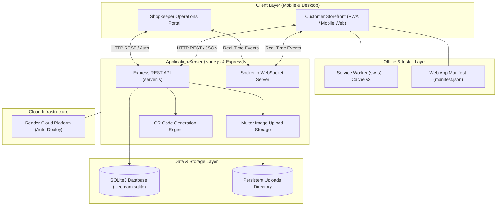

# Surya Agencies — QR-Based Self-Service Ordering & Inventory System

> **Project Better Tomorrow — Project Review 1 Submission**  
> **Milestone Status:** Working Prototype & Core Architecture Implementation (~35% Project Milestone)  
> **Live Production URL:** [https://surya-agencies.onrender.com](https://surya-agencies.onrender.com)  
> **Submission Commit:** `409f789`  
> **Primary Repository:** [https://github.com/vivin222/surya-agencies-project-review-1](https://github.com/vivin222/surya-agencies-project-review-1)

---

## 📌 1. Project Overview

**Surya Agencies** is an authorized retail distributor and parlour for **Hatsun Agro Product Ltd** brands, including **Arun Icecreams** and **Hatsun Dairy Products**. 

This project introduces a modern, QR-based self-service ordering and inventory management system engineered to eliminate peak-hour queue bottlenecks, reduce customer waiting times, and streamline daily counter operations for retail dairy and ice cream parlours.

---

## 🚨 2. Problem Statement

In retail ice cream and dairy parlours such as Surya Agencies, evening peak hours and weekend rushes create severe operational bottlenecks:

1. **Sequential Queue Congestion:** During peak periods, **12 to 15 customers** frequently queue up simultaneously while a single shopkeeper handles product inquiries, physically verifies freezer inventory, packs items, calculates billing, and collects payments sequentially.
2. **Inquiry-Driven Delays & Walkaways:** Because customers cannot view available flavors or current stock levels without asking the shopkeeper, the shopkeeper spends significant time opening and searching through deep freezers. This causes extended waiting times, customer frustration, and walkaway abandonment.
3. **Limitations of Conventional Alternatives:**
   * *Traditional Point-of-Sale (POS) Systems:* POS terminals only assist at the final billing stage and do not offload product browsing, inquiry handling, or order configuration from the shopkeeper.
   * *WhatsApp / Phone Ordering:* Requires continuous manual back-and-forth messaging from the shopkeeper during already intense counter hours.

---

## 💡 3. Proposed Solution

The **Surya Agencies Self-Service System** provides a lightweight, scan-and-order Web Application and Progressive Web App (PWA) that decouples customer browsing from counter fulfillment:

* **Customer Self-Service:** Customers scan a tabletop/counter QR code or open the web link on their mobile devices to browse the complete 95+ item catalog, verify real-time stock availability, customize their cart, pay via a valid UPI QR code, and receive a digital Order Token with a scannable Ticket QR.
* **Shopkeeper Operations Portal:** The shopkeeper receives instant visual and audio notifications via WebSockets (Socket.io), scans the customer's Ticket QR with a built-in camera scanner, and fulfills orders efficiently with single-tap status transitions.
* **Unified Real-Time Inventory:** Prevents overselling by automatically decrementing stock upon order creation, alerts the shopkeeper to low-stock thresholds, and maintains separate online vs. walk-in stock allocations.

---

## 🏗️ 4. System Architecture

The project is built on a clean, responsive, and decoupled architecture utilizing lightweight web standards, persistent relational database storage, and real-time WebSocket communication:



---

## 📦 5. Component Breakdown & Implementation Evidence

Each implemented module is grounded in concrete, audited codebase files:

### A. Customer Storefront
* **Interactive Product Catalog (95+ Branded Items):** Full catalog across 8 categories (Cones, Cups & Duets, Bars & Sticks, Tubs, Cakes, Novelties, Sundaes, Dairy) with high-resolution imagery and price specifications.
  * *Evidence:* `index.html`, `js/customer-app.js`, `sample-data.js`
* **Instant Search & Category Filtering:** Real-time client-side text search and responsive horizontal category button boxes with glassmorphic styling.
  * *Evidence:* `js/customer-app.js`, `css/app.css`
* **Persistent Shopping Cart:** LocalStorage-backed cart with item steppers, dynamic total calculations, and out-of-stock validation.
  * *Evidence:* `js/customer-app.js`
* **Scannable UPI Payment QR:** Generates standardized UPI payment QR codes (`upi://pay?pa=...&pn=Surya%20Agencies&am=...`) compatible with Google Pay, PhonePe, Paytm, and BHIM, alongside counter cash options.
  * *Evidence:* `js/customer-app.js`, `js/qrcode.min.js`
* **Digital Pickup Ticket & Token QR:** Instant order token generation (`#A001` – `#Z999`) with a unique scannable Ticket QR code linking directly to the customer's verified order.
  * *Evidence:* `js/customer-app.js`, `server.js`
* **5-Step Live Order Tracking:** Real-time visual order timeline (`Placed` ➔ `Accepted` ➔ `Preparing` ➔ `Ready for Pickup` ➔ `Completed`) synchronized via WebSockets.
  * *Evidence:* `js/customer-app.js`

### B. Shopkeeper Operations Portal
* **Protected Shopkeeper Authentication:** Secure credentials-based session portal for authorized parlour staff.
  * *Evidence:* `server.js`, `js/shopkeeper-app.js`
* **Live Orders Feed:** Real-time order dispatch board with status filters (`All`, `New`, `Accepted`, `Preparing`, `Ready`, `Completed`) and audio chime alerts.
  * *Evidence:* `js/shopkeeper-app.js`
* **Optical Camera Ticket QR Scanner:** In-app QR scanner powered by `Html5Qrcode` with environment camera auto-detection, photo file upload fallback, and manual Order ID lookup.
  * *Evidence:* `index.html`, `js/shopkeeper-app.js`
* **Quick Inventory Controls:** Inline `+1` / `-1` stock modifiers, minimum stock threshold alerts, and instant 1-tap availability toggles (`🟢 AVAILABLE` ↔ `🔴 NOT AVAILABLE`).
  * *Evidence:* `js/shopkeeper-app.js`, `server.js`, `db.js`
* **Product Catalog Management:** Ability to add new products, modify prices, and upload persistent product photos via Multer.
  * *Evidence:* `server.js`, `uploads/`
* **Revenue & Profit/Loss Analytics:** Daily, weekly, and monthly sales aggregation, net profit calculations, and payment breakdowns with dark-mode contrast optimization.
  * *Evidence:* `js/shopkeeper-app.js`, `db.js`

### C. Backend, Database & Real-Time Engine
* **RESTful API Service:** Express.js API handling product listings, order transactions, QR generation, image uploads, and reporting.
  * *Evidence:* `server.js`
* **ACID-Compliant Relational Database:** SQLite3 database with parameterized SQL, transactional order placement, and automatic stock deduction.
  * *Evidence:* `db.js`, `icecream.sqlite`
* **Deterministic IST Timestamps:** All orders, notifications, and reports are recorded in server-side ISO 8601 UTC and rendered in **India Standard Time (IST — Asia/Kolkata)** on all devices.
  * *Evidence:* `db.js`, `js/customer-app.js`, `js/shopkeeper-app.js`
* **Socket.io Real-Time Synchronization:** WebSocket events broadcasting new orders, status transitions, inventory changes, and availability toggles.
  * *Evidence:* `server.js`, `js/socket-client.js`

### D. Progressive Web App (PWA) Foundation
* **Web App Manifest:** Standalone display configuration with brand icons (192x192, 512x512) and theme color (`#e11d48`).
  * *Evidence:* `manifest.json`
* **Service Worker Caching:** Cache-first asset delivery with dynamic network-first routing for API and WebSocket connections.
  * *Evidence:* `sw.js`
* **Platform-Specific Install Flow:** Native PWA installation on Android/Chrome and guided 3-step Home Screen addition on iOS Safari.
  * *Evidence:* `index.html`, `js/app.js`

---

## 🛠️ 6. Technology Stack

| Component | Technology | Version / Specification | Role in System |
| :--- | :--- | :--- | :--- |
| **Frontend Framework** | Vanilla JavaScript | ES6+ Standard | Client-side application logic and state management |
| **UI Styling** | Tailwind CSS | Tailwind CDN v3.x + Custom CSS | Mobile-first responsive UI with Dark/Light theme support |
| **Backend Engine** | Node.js / Express.js | Express v4.21.2 | REST API routing, authentication, and static asset delivery |
| **Real-Time Layer** | Socket.io | Socket.io v4.8.1 | Bi-directional WebSocket communication for live sync |
| **Database** | SQLite3 | sqlite3 v5.1.7 | Embedded relational database with transaction support |
| **QR Code Engine** | `qrcode` / `html5-qrcode` | qrcode v1.5.4, html5-qrcode v2.3.8 | Optical QR generation and device camera scanning |
| **File Handling** | Multer | multer v1.4.5-lts.1 | Multipart form upload handling for product imagery |
| **PWA Layer** | Service Worker API | Cache API v2 | Offline asset caching and mobile installability |
| **Cloud Hosting** | Render | Cloud Platform | Automatic continuous deployment from GitHub `main` |

---

## 📊 7. Project Milestone Roadmap

> **Note on Milestone Percentages:** The percentages (~35%, ~60%, ~80%, 100%) represent **project lifecycle progress stages and evaluation milestones**, NOT the proportion of source code files in the repository.

### Milestone 1: Review 1 — ~35% Project Milestone [COMPLETED]
* **Scope & Focus:** Complete working prototype demonstrating full end-to-end self-service ordering, live shopkeeper management, optical QR ticket generation/scanning, inventory deduction, and real-time Socket.io updates.
* **Status:** **100% Implemented & Verified in Codebase.**

### Milestone 2: Field Testing & User Evaluation — ~60% Project Milestone [NEXT PHASE]
* **Scope & Focus:** Real-world validation at the Surya Agencies parlour:
  * On-site testing with at least 3 real customers during active business hours.
  * Measuring ordering time per customer before vs. after introducing QR self-service.
  * Quantifying reduction in shopkeeper inquiry interactions.
  * Validating optical QR scanner success rates across various smartphone cameras and lighting conditions.
  * Collecting structured feedback on UI clarity, checkout simplicity, and receipt comprehension.
  * Identifying edge cases, usability frictions, and mobile layout nuances.
* **Status:** **Planned Next-Stage Validation Work.**

### Milestone 3: Iterative Refinement & Optimization — ~80% Project Milestone [FUTURE PHASE]
* **Scope & Focus:** Engineering refinements driven by field evaluation findings:
  * Optimizing touch targets, cart interactions, and search indexing for low-end mobile devices.
  * Enhancing QR scanner detection speed and low-light tolerance.
  * Refining offline resilience and reconnection handling during intermittent network drops.
  * Advanced inventory analytics (daily item velocity, peak-hour demand forecasting).
  * Second-round usability verification and before/after metrics comparison.
* **Status:** **Future Planned Engineering Work.**

### Milestone 4: Final Validation & Delivery — 100% Project Milestone [FINAL PHASE]
* **Scope & Focus:** Final project sign-off and reporting:
  * Comprehensive before/after performance comparison (queue wait time reduction, throughput increase).
  * Formal Prototype & Validation Report.
  * Security, input validation, and deployment audit.
  * Final client handover and documentation archive.
* **Status:** **Final Stage Deliverable.**

---

## ⚖️ 8. Scope Matrix: Current vs. Future Work

| Functional Area | Review-1 Implementation Status (~35%) | Planned Future Validation / Work (~60% – 100%) |
| :--- | :--- | :--- |
| **Working Prototype** | ✅ **Functional & Live** (Complete ordering & management) | Iterative refinements based on customer feedback |
| **Customer Storefront** | ✅ **Implemented** (95+ items, search, cart, UPI QR) | Usability optimization for low-end devices |
| **Shopkeeper Portal** | ✅ **Implemented** (Orders feed, quick steppers, reports) | Workflow speed and batch fulfillment enhancements |
| **QR Code System** | ✅ **Implemented** (UPI payment QR + Ticket QR Scanner) | Field scan rate testing under varying lighting |
| **Inventory Management**| ✅ **Implemented** (Stock sync, availability toggles) | Demand forecasting and automated reorder alerts |
| **Real-Time Sync** | ✅ **Implemented** (Socket.io bi-directional updates) | Reconnection handling under network drops |
| **PWA & Offline** | ✅ **Implemented** (Service Worker caching, Android/iOS install) | Extended offline catalog browsing |
| **User Field Testing** | ⏳ **Pending** (Scheduled for next milestone) | On-site testing with $\ge 3$ real customers |
| **Quantitative Metrics**| ⏳ **Pending** (Scheduled for next milestone) | Queue wait-time and transaction-time benchmarking |
| **Validation Report** | ⏳ **Pending** (Scheduled for final milestone) | Comprehensive validation report compilation |

---

## 🎯 9. Evaluation Criteria Mapping (Review-1)

| Evaluation Criterion | Implementation Evidence in Repository | Verified File Reference |
| :--- | :--- | :--- |
| **Problem Understanding** | Real-world field observation of Surya Agencies peak-hour queue bottlenecks and single-shopkeeper inquiry overload. | `README.md` (Sections 1 & 2) |
| **Technical Feasibility** | Functional client-server architecture with SQLite3 persistence, Express REST APIs, and Socket.io WebSockets. | `server.js`, `db.js`, `package.json` |
| **Core Functionality** | 95+ item catalog, search, shopping cart, UPI checkout, Ticket QR generation, camera QR scanning, and stock controls. | `index.html`, `js/customer-app.js`, `js/shopkeeper-app.js` |
| **Real-Time Integration** | Instant bi-directional synchronization of orders, statuses, and stock levels across connected clients. | `server.js`, `js/socket-client.js` |
| **Technical Verification** | Passing automated test suites covering inventory logic, IST timestamps, and optical QR workflows. | `test_inventory_logic.js`, `test_e2e_scenario.js` |
| **Cloud Deployment** | Live continuous deployment on Render with HTTPS and PWA installability. | [Live URL](https://surya-agencies.onrender.com) (`render.yaml`) |
| **Roadmap & Validation** | Structured progression roadmap defining clear validation goals for 60%, 80%, and 100% milestones. | `README.md` (Sections 7 & 8) |

---

## 🧪 10. Automated Testing & Verification Evidence

The repository includes automated test suites validating critical business logic, inventory allocations, and optical QR operations:

```
============================================================
1. INVENTORY & SPLIT STOCK ALLOCATION SUITE (test_inventory_logic.js)
============================================================
✓ Product addition with split stock validation: PASS
✓ Invalid stock allocation bounds enforcement: PASS
✓ Online order decrements online stock only: PASS
✓ Walk-in sale decrements walk-in stock only: PASS
✓ Order cancellation restores allocated stock: PASS
✓ Sales analytics and revenue split verification: PASS
Result: ALL CORE INVENTORY TESTS PASSED (100%)

============================================================
2. REAL-TIME ORDER TIME & IST SUITE (test_order_time_ist.js)
============================================================
✓ ISO 8601 UTC server-side generation at creation: PASS
✓ Asia/Kolkata (IST) deterministic cross-device formatting: PASS
✓ Single canonical timestamp across database & feeds: PASS
Result: ALL TIMESTAMP TESTS PASSED (100%)

============================================================
3. TICKET QR & CAMERA SCANNER SUITE (test_category_ui_and_qr_scanner.js)
============================================================
✓ Order creation & standardized Ticket QR URL generation: PASS
✓ Optical QR image decoding with jsQR: PASS
✓ Universal scanner ID extraction (raw, hash, URI-encoded): PASS
✓ Order lookup & 5-step status progression (NEW -> COMPLETED): PASS
Result: ALL 10 TESTS PASSED (100%)
```

---

## 💻 11. Local Setup & Execution Guide

### Prerequisites
* **Node.js:** v16.0.0 or higher
* **npm:** v8.0.0 or higher

### Installation & Startup Steps

1. **Clone the repository:**
   ```bash
   git clone https://github.com/vivin222/surya-agencies-project-review-1.git
   cd surya-agencies-project-review-1
   ```

2. **Install dependencies:**
   ```bash
   npm install
   ```

3. **Start the application server:**
   ```bash
   npm start
   ```
   *(For development mode with auto-reload: `npm run dev`)*

4. **Access the application:**
   * **Main Gateway:** `http://localhost:3000`
   * **Customer Store:** `http://localhost:3000/#customer`
   * **Shopkeeper Portal:** Available through the deployed application using the designated demonstration credentials.

5. **Execute automated test suites:**
   ```bash
   npm test
   ```

---

## 🌐 12. Live Production Deployment

* **Production URL:** [https://surya-agencies.onrender.com](https://surya-agencies.onrender.com)
* **Customer Storefront:** [https://surya-agencies.onrender.com/#customer](https://surya-agencies.onrender.com/#customer)
* **Shopkeeper Operations Portal:** [https://surya-agencies.onrender.com/#shopkeeper](https://surya-agencies.onrender.com/#shopkeeper)
* **Hosting Provider:** Render Cloud Platform
* **Deployment Branch:** `main` (Continuous Auto-Deployment)

---

## 👥 13. Project Submission Metadata

* **Project Title:** Surya Agencies — QR-Based Self-Service Ordering & Inventory System
* **Initiative:** Project Better Tomorrow
* **Evaluation Milestone:** Project Review 1 (~35% Core Architecture & Prototype)
* **Submission Commit:** `409f789`
* **Target Enterprise:** Surya Agencies (Authorized Hatsun & Arun Icecream Parlour)
* **Industry Domain:** Retail Dairy & Ice Cream Parlour Automation
